# 🛒 Superstore Sales & Marketing Strategy Analysis

> **Dataset:** [Kaggle Superstore Dataset](https://www.kaggle.com/datasets/vivek468/superstore-dataset-final) &nbsp;|&nbsp; **Period:** 2014–2017 &nbsp;|&nbsp; **Market:** United States only &nbsp;|&nbsp; **Tools:** Python · Pandas · Matplotlib · Seaborn

---

## 📌 Key Numbers at a Glance

| Metric | Value |
|---|---|
| Total Sales (4 yrs) | **$2.3M** |
| Top 30% of customers → share of sales | **60%** |
| Top 30% of customers → share of profit | **97%** |
| Sales growth 2014→2017 | **+55%** |
| #1 city by profit | **New York City ($62K)** |
| Most profitable sub-category | **Copiers** |
| Loss-making sub-categories | **Tables · Bookcases** |

---

## 1 · Geographic Performance

**All sales are in the United States.** California leads in raw sales volume; New York leads in profit.

### Top 20 States — Sales vs Profit

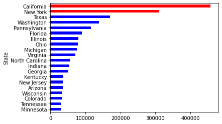
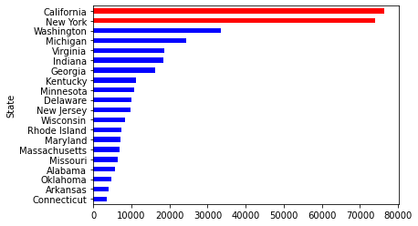

> 🔑 **California (#1 sales, #2 profit) vs New York (#2 sales, #1 profit).** New York converts revenue to profit more efficiently. Texas is a major loss state despite ranking #3 in sales.

### State Profitability Map

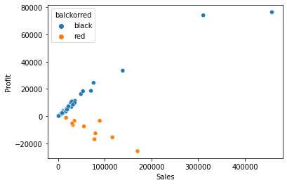

> Orange dots = loss-making states. Several states with $50K–$150K in sales are running negative profit — likely due to over-discounting or poor product mix.

### Top 20 Cities — Sales vs Profit

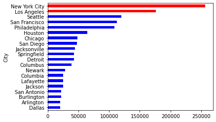
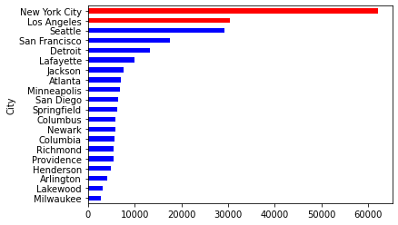

> 🔑 **New York City** is the standout — ~$62K profit, nearly double Seattle (#2). **Los Angeles** ranks #2 in sales but runs at a loss.

---

## 2 · Customer Analysis

### Pareto Rule — Sales & Profit are Highly Concentrated

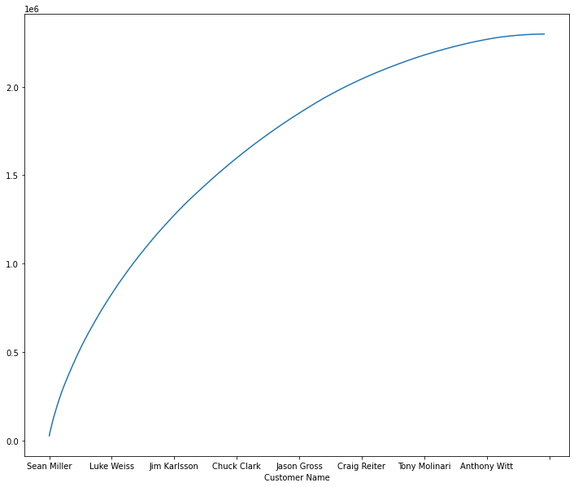
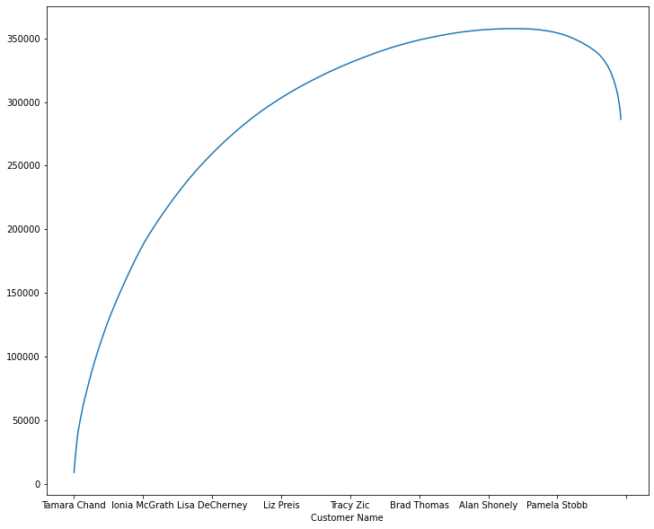

| | Sales | Profit |
|---|---|---|
| Top 30% of customers | **60% of total** | **97% of total** |
| Bottom 70% of customers | 40% of total | Erode profit (curve bends down) |

> ⚠️ The profit cumulative curve **peaks then drops** — the bottom customers are net-negative. This is the most important finding in the dataset.

### Top Customers by Sales vs Profit

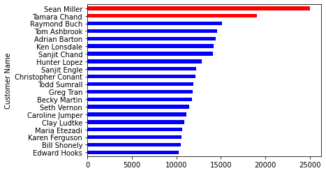
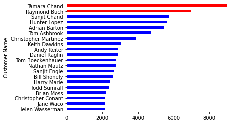

> 🚨 **Sean Miller** is the #1 customer by sales (~$25K) but does **not appear** in the top-20 profit chart. He is likely net-negative profit. The business may be offering excessive discounts to its largest revenue account.

### Customer Profitability Scatter (All Customers)

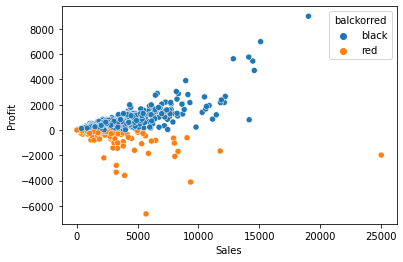

> Blue = profitable customers · Orange = loss-making customers. Loss customers are spread across all sales levels — not just small accounts.

---

## 3 · Product Categories

### Sales vs Profit by Category

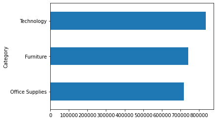
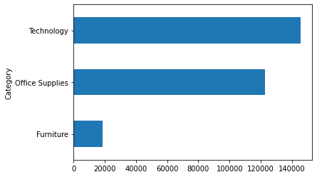

| Category | Sales | Profit | Margin |
|---|---|---|---|
| Technology | ~$836K | ~$145K | **17.3%** |
| Office Supplies | ~$719K | ~$122K | **17.0%** |
| Furniture | ~$742K | ~$18K | **2.4%** ⚠️ |

> Furniture generates similar sales to Office Supplies but **9× less profit**. It is essentially a break-even category.

### Sub-Categories — Sales & Profit

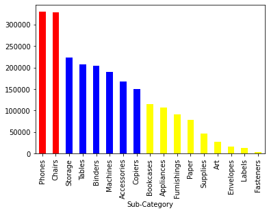
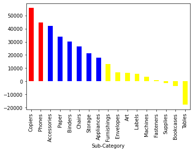

> 🔑 **Phones** = #1 in sales, #2 in profit — top performer overall. **Copiers** = #1 in profit despite mid-tier sales — massively under-promoted. **Tables** and **Bookcases** are loss-making sub-categories that should be repriced or deprioritised.

---

## 4 · Time Series — 2014 to 2017

### Annual Growth

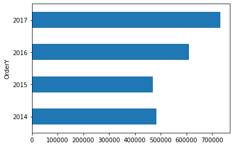
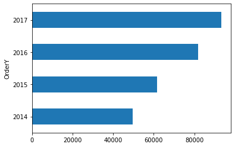

### Monthly Trends

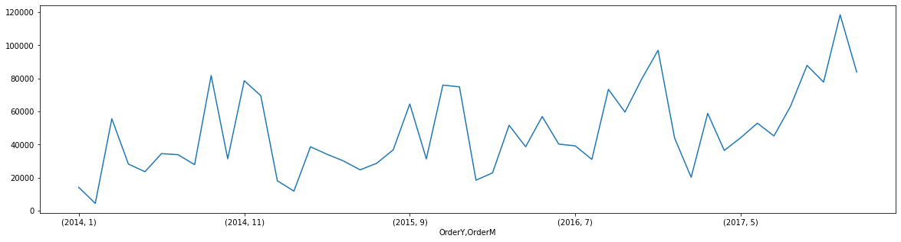
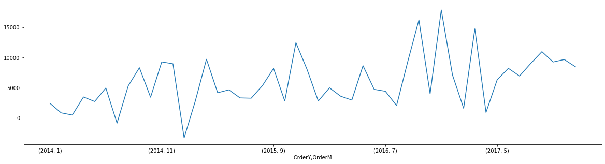

> 📈 Sales and profit grew every year. **Q4 (Oct–Dec) spikes reliably every year** — November 2017 was the single highest month (~$120K). December 2014 showed an unusual negative profit dip despite high sales — likely a one-time discount event.

---

## 5 · Recommendations

| # | Finding | Action |
|---|---|---|
| 1 | Top 30% of customers = 97% of profit | Build retention programme for this cohort specifically |
| 2 | Sean Miller: #1 sales, near-zero profit | Review discount rate — relationship may not be commercially viable |
| 3 | Tables & Bookcases run negative profit | Stop discounting these SKUs or reprice immediately |
| 4 | Copiers: #1 profit, mid-tier sales | Increase marketing investment — most under-sold high-margin item |
| 5 | Los Angeles & Texas: high sales, negative profit | Freeze new marketing spend pending root-cause audit |
| 6 | Q4 spikes every year without fail | Front-load Q4 inventory and promotions 3 months in advance |

---

## 🗂️ Repository Structure

```
├── data-analysis-for-marketing-strategy.ipynb   # Full analysis notebook
├── images/                                       # All chart exports
└── README.md                                     # This file
```

## 🔧 Tools Used

`Python` · `Pandas` · `NumPy` · `Matplotlib` · `Seaborn`
